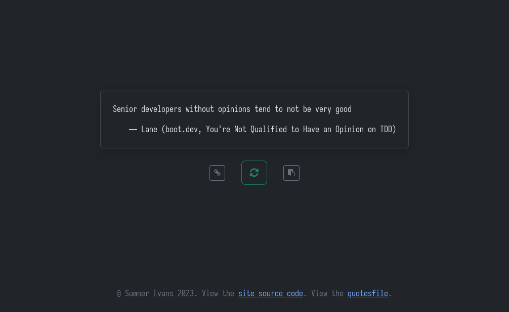

# webfortune

A simple website that shows a random quote from a quotesfile.

## Usage

Use the following environment variables to configure webfortune:

- `LOG_CONSOLE` --- enable pretty console logging from zerolog
- `LISTEN_ADDR` --- the address to listen on.
- `QUOTESFILE` --- the quotesfile to read quotes from. Should be formatted in
  the same way as `strfile`.
- `HOST_ROOT` --- the root URL at which webfortune is hosted.
- `QUOTESFILE_SOURCE_URL` --- a URL pointing to the source of the quotesfile
  (optional).
- `GOATCOUNTER_DOMAIN` --- the `data-goatcounter` value for GoatCounter
  analytics.
